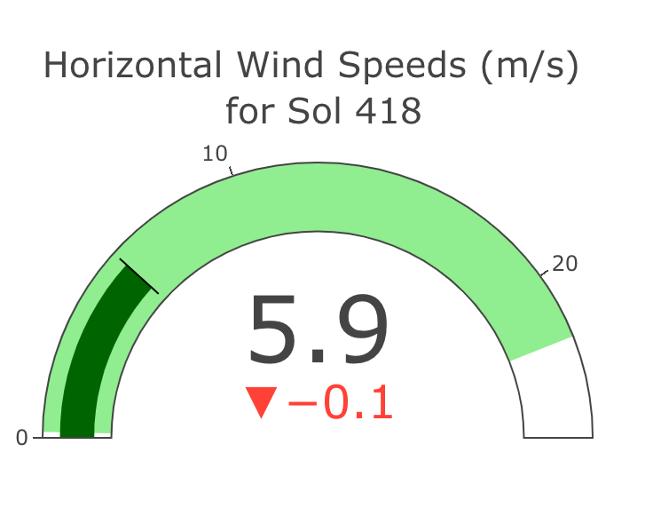

# 534 Project

**Contributors:** Claudia Nikel, KT Hobbs & Shreeram Murali

# NASA Mars API
To retrieve and visualize weather data from the last 7 Sols (Martian days) as recorded and updated daily by NASAs InSight Mars lander. InSight is located at Elysium Planitia, a flat surface near the equator of Mars.

# Installation:
clone repository

`git clone https://github.com/claudia-nikel/534_project/`

in command line:

`R CMD build maRs`

`R CMD INSTALL maRs_0.1.tar.gz`

in R console:

`library(maRs)`

# Software Requirements
`maRs` was built on R version 3.5.0; therefore, it is recommended to use a similar version or higher to avoid compatability issues.

# Functions
`marsInfo`: returns a summary table of weather including the Sol number, datetime stamp of first recorded sample (`First_UTC`), last recorded sample (`Last_UTC`), the current season for Mars, as well as average (`av`), sample size (`ct`), minimum (`mn`) and maximum (`mx`) recordings for temperature (`AT`), horizontal windspeed (`HWS`), and pressure (`PRE`).

`windspeed`: retrieves the inputted Sol's horizontal wind speed (m/s) from the summary table and visualizes it as a dial. The black bar is the average windspeed for the Sol, which corresponds to the black text. The green background is the sol range (min and max), and the red or green text below is represents a decrease or increase, respectively, relative to the previous sol's average.

`pressure`: retrieves the inputted Sol's pressure (Pascal) from the summary table and visualizes it as a dial. The black bar is the average pressure for the Sol, which corresponds to the black text. The orange background is the sol range (min and max), and the red or green text below is represents a decrease or increase, respectively, relative to the previous sol's average.

`temperature`: retrieves the inputted Sol's temperature (converted from Farhenheit to degrees Celsius) from the summary table and visualizes it as a dial. The black bar is the average temperature for the Sol, which corresponds to the black text. The blue background is the sol range (min and max), and the red or green text below is represents a decrease or increase, respectively, relative to the previous sol's average.

# Input

## Summary Table 
Input your API key generated on [NASA Open APIs](https://api.nasa.gov/?search=mars) into the function `marsInfo()`.

## Visualizations
For windspeed, pressure, and temperature visualizations, user must input a number from the previous 7 Sols .

`windspeed(417)`

If the input is not within the last 7 Sols, an error message will return listing valid options.

# Output Example

